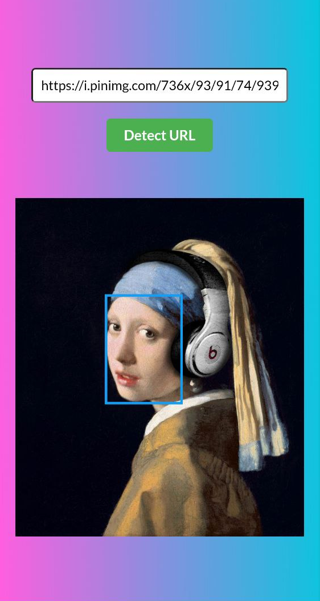
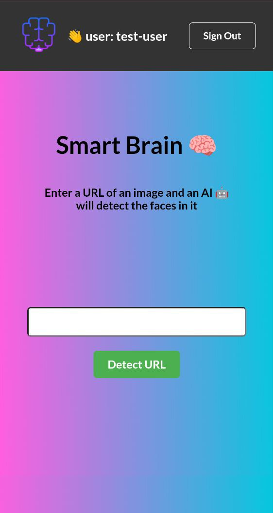

<h1 align="center"> ai-face-detect </h1>

<p align="center">
</img>
</p>

<p align="center">
🧠 AI Face recognition and image description web app built in React.js
</p>

<div>
  
  
  
  
</div>

<br></br>

## 💾 Installation & Setup

```sh
# 📥 Clone the repository
git clone https://github.com/nady4/ai-face-detect.git

# 📂 Move to the project folder
cd ai-face-detect-api

# 📦 Install dependencies
npm install

# 🚀 Run the development server
npm run dev
```

<br></br>

## 🚀 Tech Stack

| Technology       | Version |
| ---------------- | ------- |
| React            | ~18.3   |
| React DOM        | ~18.3   |
| React Router DOM | ~7.5    |
| React Toastify   | ~11.0   |
| Sass             | ~1.87   |
| Vite             | ~6.3    |
| TypeScript       | ~5.6    |
| face-api.js      | ~0.20   |

<br></br>

## 📬 Contact

- 💌 Email: **nadyajerochim@gmail.com**
- 💼 LinkedIn: [/nady4](https://www.linkedin.com/in/nady4)
- 👩🏻‍💻 GitHub: [@nady4](https://github.com/nady4)
